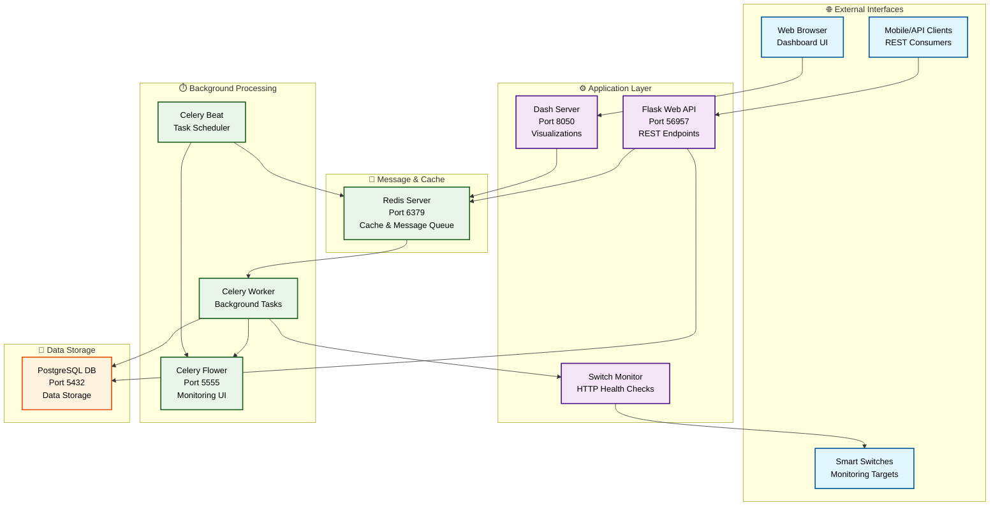
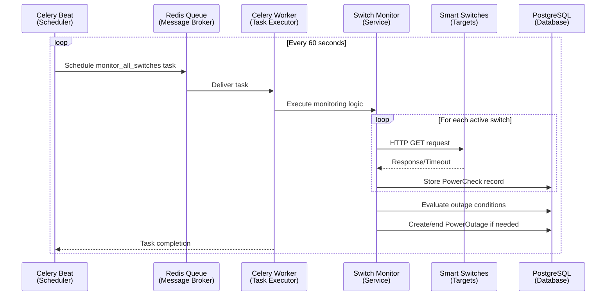
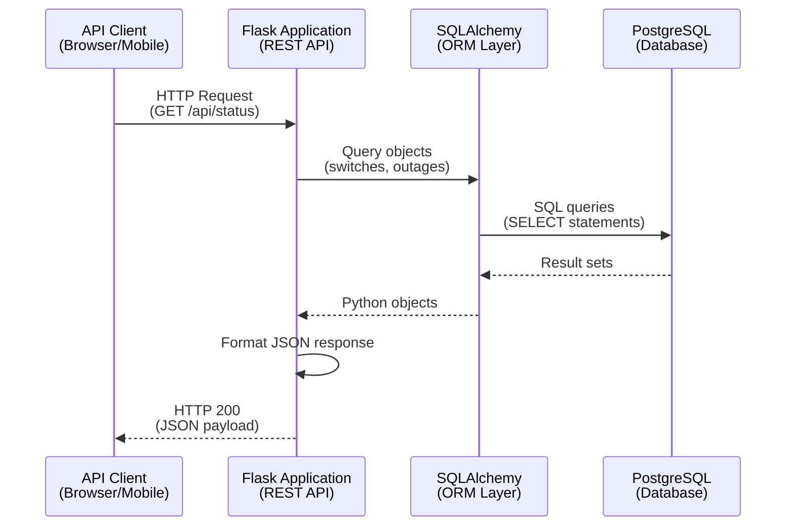
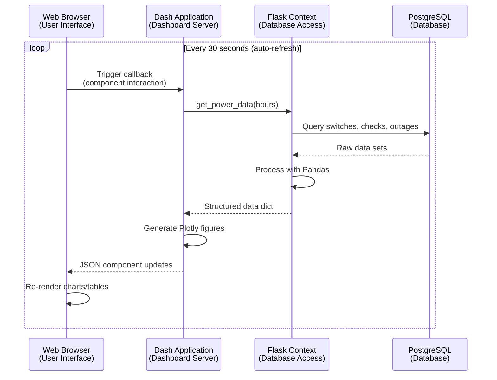

# PowerMon Architecture

This document provides a comprehensive overview of PowerMon's system architecture, components, and design decisions.

## System Overview

PowerMon is a distributed system built using a microservices approach with Docker containers. The system monitors smart switches to detect power outages and provides real-time visualization and historical analysis.



## Core Components

### 1. Flask Web Application (`app/`)

**Purpose**: Main application server providing web interface and REST API

**Key Modules**:

- `app/__init__.py`: Application factory pattern, Celery configuration
- `app/models.py`: SQLAlchemy database models
- `app/main/routes.py`: Web interface routes and templates
- `app/api/routes.py`: REST API endpoints
- `app/services/switch_monitor.py`: Core monitoring business logic

**Technologies**:

- Flask 3.x with Blueprint organization
- SQLAlchemy ORM for database operations
- Gunicorn WSGI server for production
- Request handling for HTTP-based switch monitoring

### 2. Dash Dashboard (`dashboard.py`)

**Purpose**: Real-time data visualization and interactive charts

**Features**:

- Real-time power status timeline
- Switch uptime percentage charts
- Power outage duration analysis
- Historical trend visualization
- Auto-refresh every 30 seconds

**Technologies**:

- Dash/Plotly for interactive visualizations
- Pandas for data manipulation
- Real-time callbacks for dynamic updates

### 3. Database Layer (PostgreSQL)

**Purpose**: Persistent data storage for monitoring data

**Schema Design**:

```sql
SmartSwitch
├── id (Primary Key)
├── name (Unique switch identifier)
├── ip_address (Network location)
├── is_active (Monitoring enabled flag)
├── created_at, updated_at (Timestamps)

PowerCheck
├── id (Primary Key)
├── switch_id (Foreign Key → SmartSwitch)
├── is_online (Boolean status)
├── response_time (HTTP response time)
├── error_message (Failure details)
├── checked_at (Timestamp, Indexed)

PowerOutage
├── id (Primary Key)
├── started_at (Outage start time, Indexed)
├── ended_at (Outage end time, Nullable)
├── duration_seconds (Calculated duration)
├── switches_affected (JSON array of switch IDs)
├── is_ongoing (Boolean flag, Indexed)
```

**Indexing Strategy**:

- `(switch_id, checked_at)` for efficient power check queries
- `(started_at, is_ongoing)` for outage analysis
- Time-based partitioning considerations for large datasets

### 4. Background Processing (Celery)

**Purpose**: Asynchronous task processing and scheduled monitoring

**Task Architecture**:

```python
Celery Beat (Scheduler)
├── monitor_all_switches (Every 60s)
├── cleanup_old_power_checks (Daily at 2 AM)

Celery Worker (Executor)
├── Switch connectivity checks
├── Database operations
├── Outage detection logic
├── Data cleanup tasks
```

**Task Flow**:

1. Celery Beat schedules `monitor_all_switches` task
2. Celery Worker picks up task from Redis queue
3. Worker calls `SwitchMonitor.check_all_switches()`
4. Results stored in PostgreSQL
5. Outage detection runs automatically

### 5. Caching & Message Queue (Redis)

**Purpose**: High-performance caching and message broker

**Usage Patterns**:

- **Message Broker**: Celery task queue management
- **Result Backend**: Task result storage
- **Session Storage**: Flask session management
- **Caching**: Future enhancement for API response caching

## Data Flow Architecture

### Monitoring Flow



### API Request Flow



### Dashboard Data Flow



## Monitoring Algorithm

### Switch Detection Logic

```python
def check_switch_status(switch):
    """
    PowerMon uses HTTP availability as power indicator
    """
    try:
        response = requests.get(f"http://{switch.ip}", timeout=5)
        # ANY HTTP response indicates device is powered and reachable
        return True, response_time, None
    except (ConnectionError, Timeout):
        # Connection failures indicate power/network issues
        return False, None, error_message
```

### Outage Detection Algorithm

```python
def evaluate_power_outages(check_results):
    """
    Intelligent outage detection based on switch patterns
    """
    offline_count = sum(1 for r in results if not r['is_online'])
    total_switches = len(results)

    # Configurable threshold (default: 50% of switches)
    is_outage = offline_count >= (total_switches * OUTAGE_THRESHOLD)

    if is_outage and not ongoing_outage:
        create_outage_record()
    elif not is_outage and ongoing_outage:
        end_outage_record()
```

## Performance Considerations

### Database Performance

1. **Indexing Strategy**:
   - Composite indexes on `(switch_id, checked_at)` for time-series queries
   - Separate indexes on frequently filtered columns

2. **Data Retention**:
   - Automatic cleanup of records older than 30 days
   - Configurable retention policies
   - Consider partitioning for large deployments

3. **Query Optimization**:
   - Limit result sets with pagination
   - Use database aggregations for statistics
   - Implement query result caching

### Application Performance

1. **Connection Pooling**:
   - SQLAlchemy connection pooling for database
   - Redis connection pooling for caching

2. **Asynchronous Processing**:
   - Non-blocking monitoring via Celery
   - Concurrent switch checks within tasks

3. **Caching Strategy**:
   - Redis for session management
   - Future: API response caching
   - Dashboard data caching for performance

## Security Architecture

### Network Security

1. **Internal Communication**:
   - All services communicate via Docker internal networks
   - External ports only where necessary (web interfaces)

2. **Data Encryption**:
   - PostgreSQL connections can use SSL
   - Redis AUTH for production deployments

3. **Access Control**:
   - Flask session management
   - Future: Authentication and authorization layers

### Application Security

1. **Input Validation**:
   - SQLAlchemy ORM prevents SQL injection
   - Request validation in API endpoints

2. **Configuration Management**:
   - Environment variables for sensitive data
   - Separate development/production configs

## Scalability Considerations

### Horizontal Scaling

1. **Stateless Services**:
   - Flask and Dash applications are stateless
   - Can scale with load balancers

2. **Worker Scaling**:
   - Multiple Celery workers for high switch counts
   - Queue-based distribution of monitoring tasks

3. **Database Scaling**:
   - Read replicas for dashboard queries
   - Write scaling with connection pooling

### Performance Monitoring

1. **Application Metrics**:
   - Celery Flower for task monitoring
   - Database query performance tracking

2. **Infrastructure Metrics**:
   - Docker container resource usage
   - Network latency to monitored switches

## Deployment Architecture

### Container Strategy

```yaml
Services:
  web: # Flask API (Gunicorn)
  dash: # Dashboard server
  postgres: # Database
  redis: # Cache/Message broker
  celery_worker: # Task processor
  celery_beat: # Task scheduler
  celery_flower: # Monitoring UI
```

### Health Checks

All services include comprehensive health checks:

- Database connectivity validation
- Redis availability checks
- Service startup dependencies
- Rolling deployment support

### Environment Management

1. **Development**: Docker Compose with volume mounts
2. **Production**: Environment-specific configurations
3. **CI/CD**: Automated testing and deployment

## Extension Points

### Adding New Monitoring Protocols

```python
class CustomSwitchMonitor(SwitchMonitor):
    def check_switch_status(self, switch):
        if switch.protocol == 'SNMP':
            return self.check_snmp(switch)
        elif switch.protocol == 'PING':
            return self.check_ping(switch)
        else:
            return super().check_switch_status(switch)
```

### Custom Alert Systems

```python
def _evaluate_power_outages(self, results):
    super()._evaluate_power_outages(results)
    if outage_detected:
        self.send_notifications(outage)  # Email, SMS, Webhooks
```

### Advanced Analytics

Future enhancements could include:

- Machine learning for outage prediction
- Pattern analysis for maintenance scheduling
- Integration with weather data for correlation
- Smart home integration for automated responses

## Technology Stack Summary

| Component           | Technology     | Version | Purpose                      |
| ------------------- | -------------- | ------- | ---------------------------- |
| **Web Framework**   | Flask          | 3.1+    | API and web interface        |
| **Database**        | PostgreSQL     | Latest  | Data persistence             |
| **Cache/Queue**     | Redis          | 7+      | Caching and messaging        |
| **Task Queue**      | Celery         | 5.3+    | Background processing        |
| **Visualization**   | Dash/Plotly    | 3.3+    | Interactive dashboards       |
| **Web Server**      | Gunicorn       | 23+     | WSGI application server      |
| **Container**       | Docker         | Latest  | Application deployment       |
| **Orchestration**   | Docker Compose | Latest  | Multi-container management   |
| **Package Manager** | uv             | Latest  | Python dependency management |
| **Code Quality**    | Ruff           | Latest  | Linting and formatting       |
| **Task Runner**     | just           | Latest  | Development commands         |

This architecture provides a robust, scalable foundation for power monitoring with clear separation of concerns, comprehensive monitoring capabilities, and extensive customization options.
